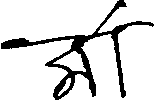

# Kaggle Bengaliai competition

*   Description:  For this competition, you’re given the image of a handwritten Bengali grapheme and are
challenged to separately classify three constituent elements in the image: grapheme root, vowel diacritics, and consonant diacritics.

    *   Public Leaderboard: 0.9457/0.9955(#1)
    *   Private Leaderboard: 0.8984/0.9762(#1)

## Image Preprocessing
### 1. Raw Image (137*236)
    *   

### 2. Thresholding

### 3. Edge Detection (Canny)

### 4. Region of Interest

### 5. Cut & Resize (64*64)

## Model

### Light version of ResNet18

